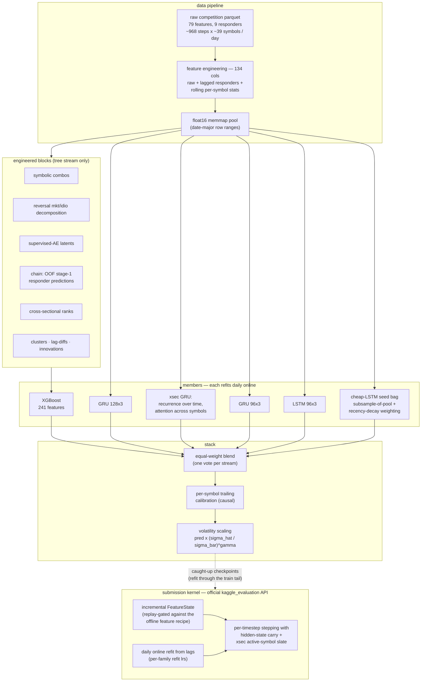

# Jane Street Real-Time Market Data Forecasting

A research codebase for the [Jane Street RTMDF Kaggle competition](https://www.kaggle.com/competitions/jane-street-real-time-market-data-forecasting):
a faithful replication of the 8th-place solution
([notes](docs/REPLICATION.md)) extended into a full experimentation
platform — feature research, architecture benchmarks, training-data
schedules, ensembling, post-processing, and a replay-validated submission
pipeline — all evaluated under one fixed walk-forward protocol with daily
online refits.

## Architecture



## Method notes

- **One evaluation protocol everywhere**: online walk-forward over the
  final dates — refit on day *d−1*, predict day *d* — with selection on
  one half of the tail and verdicts on the untouched half. Per-family
  online-refit learning rates are swept, not assumed.
- **Responder structure first**: following Kaggle discussion #555562, the
  responders are treated as forward-shifted SMAs of latent innovations;
  ridge-deconvolution of the SMA operator drives a feature "atlas" that
  seeds (and prunes) feature-engineering candidates.
- **Trees and RNNs eat differently**: engineered blocks feed the gradient-
  boosted stream; recurrent members take the base features and obtain
  cross-sectional information through attention over symbols instead.
- **Data schedule as a first-class lever**: training-window laddering,
  subsample bagging from a long date pool, and half-life recency decay of
  sample weights; capacity choices are coupled to the effective data size.
- **Auxiliary supervision**: multi-branch heads on auxiliary responders,
  with target choice treated as a signal-to-noise decision (forward
  synthetics, realized/nowcast variants).
- **Training diagnostics**: HTSR/SETOL spectral monitoring (per-epoch
  power-law exponents of layer weight spectra) via the sibling package
  [DeepUtils / tslab](https://github.com/GennaroAlberto/DeepUtils),
  including a test-set-free stopping protocol with epoch-checkpoint
  bagging.
- **Serving parity is verified, not assumed**: the incremental serving
  feature engine must match the offline recipe timestep-by-timestep on a
  replay harness before any weights ship; shipped checkpoints are
  caught up through the end of the training data.

Positive and negative results are tracked in
[docs/FEATURE_RESEARCH.md](docs/FEATURE_RESEARCH.md) (research ledger) and
[docs/WHAT_DIDNT_WORK.md](docs/WHAT_DIDNT_WORK.md) (numbered graveyard
with mechanisms). A longer pedagogical treatment lives in
[docs/book/](docs/book/).

## Quick start

```bash
uv sync                                    # environment
# download competition data into data/ (see the Kaggle page), then:
uv run python scripts/precompute_dataset.py             # memmap pool
uv run python scripts/profile_features.py               # feature atlas
uv run python scripts/rebuild_pool_ablation.py \
    --with-chain --with-ranks                           # enriched XGB stream
uv run python scripts/train_from_memmap.py \
    --data artifacts/precomputed/pool700_lags \
    --model gru_modelr_xsec --resample-mode subsample \
    --resample-frac 0.833 --pool-lo 998 --decay-halflife 175 \
    --watch --keep-epochs --tag my_member --out artifacts/bench/my_run
uv run python scripts/blend_v3.py                       # stack + calibration + vol-scale
```

Kaggle workflows: `notebooks/kaggle_batch_runner.ipynb` (GPU member
training), `notebooks/kaggle_submission.ipynb` (late-submission inference
server; weights packed by `scripts/pack_submission_weights.py`, serving
engine gated by `scripts/serving/replay_check.py`).

## Repo map

```
src/janestreet/     package: models (ModelR GRU/LSTM/xsec, AE-MLP,
                    transformers, PatchTST), pipeline, data, theory
scripts/            experiments: atlas, labs, ablations, pool builds,
                    trainers, walks, blends, serving/, SETOL stopping
notebooks/          Kaggle batch runner + submission kernel
docs/               FEATURE_RESEARCH (ledger) · WHAT_DIDNT_WORK (graveyard)
                    · REPLICATION · GPU plan · TIME_SERIES_GUIDE · book/
```

## Acknowledgments

- **Evgeniia Grigoreva's 8th-place solution** — the replication base and
  the aux-branch ModelR design ([replication notes](docs/REPLICATION.md)).
- **Kaggle discussion #555562** ("Reverse Engineering the Responders") —
  the construction insight behind the atlas and deconvolution machinery.
- **Martin & Hinrichs, SETOL** (arXiv:2507.17912) — the spectral
  diagnostics behind the training monitor.
- **The DRW crypto-forecasting 1st-place write-up** — the feature-selection
  recipe behind the combo and autoencoder blocks.
