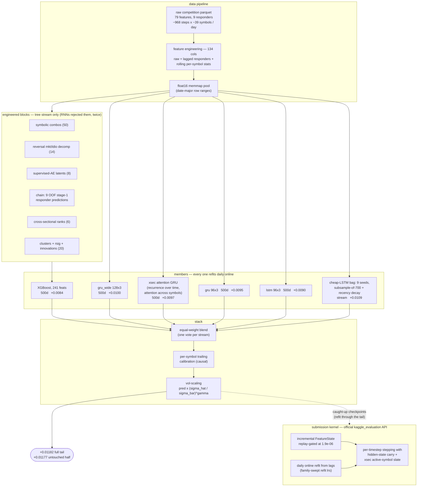

# Jane Street Real-Time Market Data Forecasting — a post-competition campaign

An end-to-end research campaign on the [Jane Street RTMDF Kaggle competition](https://www.kaggle.com/competitions/jane-street-real-time-market-data-forecasting):
starting from a faithful replication of the 8th-place (gold) solution
([details](docs/REPLICATION.md)) and systematically rebuilding every layer —
features, architectures, training-data schedules, supervision, ensembling,
post-processing, and a fully replay-validated submission pipeline — under a
fixed walk-forward protocol with pre-registered kill rules and an honest
graveyard.

**Headline**: the production stack scores **+0.01182** weighted zero-mean R²
on the untouched evaluation tail, up from **+0.00954** for the replicated
8th-place baseline under the identical protocol (+24%). Mapped through that
replication anchor, this sits **between the 4th- and 3rd-place private
scores**. A late-submission pipeline (serving features validated to 1.9e-06
against the offline recipe) turns the estimate into real private-LB reads.

| private LB reference | R² |
|---|---:|
| 1st (ms capital) | 0.01389 |
| 2nd | 0.01327 |
| 3rd | 0.01316 |
| **this work (anchor-mapped estimate)** | **~0.0127–0.0129** |
| 4th | 0.01168 |
| 8th — the replicated base | 0.01043 |

*Anchor-mapping: the replicated 8th-place stack scores +0.00954 on our tail
and scored 0.01043 private; our stack's tail score is mapped through that
offset/ratio. It is an estimate, not a leaderboard entry — the late
submission exists to replace it with a measurement.*

## Architecture



## What moved the needle

Every effect was measured on one harness: online walk-forward over the
final 100 dates, selection on the first half, verdicts on the untouched
second half, fixed seeds, effects < 0.0005 requiring replication.

**1. Reverse-engineering the responders.** Following Kaggle discussion
#555562, the responders are forward-shifted SMAs of latent innovations on
two venues. Ridge-deconvolving the SMA operator recovers the latent signal
and powered a *feature atlas* mapping every feature's lead-lag information
content. The atlas seeded most winning blocks — and predicted most losing
ideas (anything low-frequency was already inside the rolling stats; that
one insight correctly forecast the failure of expanding-window, Fourier,
and within-day-context features before they were run).

**2. The enriched tree stream.** Nine feature blocks, individually ablated
and then jointly rebuilt: out-of-fold responder-chain predictions
(+0.00084 marginal — the largest single block; textbook stacking hygiene),
supervised-autoencoder bottlenecks, atlas-seeded symbolic combos,
cross-sectional ranks, market/idio reversal decomposition, and more. Trees
absorbed all of it; **the RNNs rejected the identical blocks at two
dosages** — recurrent members get their cross-sectional information through
attention instead.

**3. Cross-sectional attention — the one transformer that paid.** On a
synthetic world built from the reverse-engineered DGP, attention over time
and over features lost to a plain GRU four separate ways (vanilla 54% of
the reference ceiling, iTransformer 56%, TimeXer 45%, PatchTST 62%, GRU
80%). Attention across **symbols** — recurrence along time, attention
across the cross-section — matched the problem's structure and became a
full-weight stack member. It also demanded its own online-refit learning
rate: the plain-RNN refit lr silently degrades attention weights every day
of the walk; at 3e-4 the same checkpoint jumped **+0.0068 → +0.0087**.
Swept refit-lr map: LSTM 1e-3, GRU 3e-4, xsec 3e-4, sig-transformer 3e-5.

**4. The data axis beat the architecture axis.** The training-window
ladder rises monotonically through every size that fits in memory
(280d → 400d → 500d → still rising at 700d), and capacity couples to it:
width that failed at 400 days ([128,128]) leads at 500 days. The final
recipe composes three levers — **subsample bagging from the long pool**
(each seed draws ~500 of the last 700 days), **half-life recency decay**
(old days whisper, recent days shout), and seed bags. A 0.7M-parameter
member trained this way on a laptop (+0.0103) outscored the 2M-parameter
GPU flagship trained on the contiguous window.

**5. Supervision has an SNR law.** The aux-branch heads only help when
their targets are learnable: ridge-deconvolved next-innovation labels
(near-white) collapsed a member by −0.0057; the standard forward-SMA
synthetics work; **nowcast heads** (predict the *just-completed* SMA — an
easy, high-SNR task) added +0.0008. Monotone in supervision SNR,
saturating at the top.

**6. Ensembling discipline.** Admission = decorrelation + blend
improvement on the selection half — never solo score. Simple averages beat
fitted weights throughout; one vote per *stream*, not per member. The
stack's history is a sequence of admissions and refusals with numbers
attached, including the day the entire 280-day era was retired because its
streams had become pure dilution.

**7. A submission you can trust.** The serving feature engine is an
incremental twin of the offline recipe, gated by a replay harness that
streams raw rows timestep-by-timestep and demands 1e-4 agreement
(measured: 1.9e-06). Shipped checkpoints are **caught up** — online-refit
through the held-out tail plus a final update on its last day — so the
model reaches the private test with no gap between its last gradient and
the first test day.

**8. Spectral training diagnostics.** Training health runs on HTSR/SETOL
layer diagnostics (power-law exponents of weight-spectra; Martin &
Hinrichs, arXiv:2507.17912) via the sibling package
[DeepUtils / tslab](https://github.com/GennaroAlberto/DeepUtils): per-epoch
alpha bands, overfit warnings that empirically coincide with validation
peaks, and a test-set-free stopping protocol (SETOL-picked epoch +
{peak−1, peak, peak+1} checkpoint bagging) for final retrains that have no
validation set left to consult.

## Three bugs worth a section

All three were caught by one standing rule: **any score above the noise
ceiling (~0.014) is a bug, never a breakthrough.**

1. **The on-batch reshape leak.** A validation dataloader reshaped
   symbol-major rows under a time-major assumption — output shape correct,
   interior interleaved — placing future timesteps along the attention
   axis. Fit-validation read an impossible 0.15; a perturbation test proved
   the architecture causal (zero future sensitivity); the true culprit
   corrupted *epoch selection* for every attention model. One
   order-agnostic sort fixed it, and a "failed" transformer doubled its
   walk score.
2. **The symbol-major walk scramble.** The exported parquet pool is
   symbol-major; the walk's reshape assumed time-major. Every parquet-path
   walk had been scored on scrambled sequences (static ~0, online ~half
   strength). The models were fine; the ruler was broken. One idempotent
   sort in the walk.
3. **Post-walk checkpoint contamination.** Online-refit walks absorb the
   evaluation tail into the weights. Saving checkpoints *after* a walk and
   re-walking them "scored" +0.015. Provenance rule since: a checkpoint
   must predate every row it is evaluated on — post-walk weights are
   ship-forward only.

## What didn't work

Twenty numbered post-mortems live in
[docs/WHAT_DIDNT_WORK.md](docs/WHAT_DIDNT_WORK.md): path signatures (three
attempts), every time/feature-attention transformer, frequency-domain
features and models, responder history (dead even at the oracle ceiling),
hard regime routing, vol-bag specialists at production scale, the enriched
feature pool for RNNs (two dosages), innovation labels, and more — each
with its number, mechanism, and extracted rule. The positive ledger is
[docs/FEATURE_RESEARCH.md](docs/FEATURE_RESEARCH.md); the pedagogical
version of the whole methodology is a 100+ page LaTeX field manual under
[docs/book/](docs/book/).

## Reproducing

```bash
uv sync                                    # environment
# download competition data into data/ (see the Kaggle page), then:
uv run python scripts/precompute_dataset.py             # memmap pool
uv run python scripts/profile_features.py               # feature atlas
uv run python scripts/rebuild_pool_ablation.py \
    --with-chain --with-ranks                           # enriched XGB stream
uv run python scripts/train_from_memmap.py \
    --data artifacts/precomputed/pool700_lags \
    --model gru_modelr_xsec --resample-mode subsample \
    --resample-frac 0.833 --pool-lo 998 --decay-halflife 175 \
    --watch --keep-epochs --tag my_member --out artifacts/bench/my_run
uv run python scripts/blend_v3.py                       # stack + calibration + vol-scale
```

Kaggle workflows: `notebooks/kaggle_batch_runner.ipynb` (GPU member
training), `notebooks/kaggle_submission.ipynb` (late-submission inference
server; weights packed by `scripts/pack_submission_weights.py`, serving
engine gated by `scripts/serving/replay_check.py`).

## Repo map

```
src/janestreet/     package: models (ModelR GRU/LSTM/xsec, AE-MLP,
                    transformers, PatchTST), pipeline, data, theory
scripts/            the campaign: atlas, labs, ablations, pool builds,
                    trainers, walks, blends, serving/, SETOL stopping
notebooks/          Kaggle batch runner + submission kernel
docs/               FEATURE_RESEARCH (ledger) · WHAT_DIDNT_WORK (graveyard)
                    · REPLICATION · GPU plan · TIME_SERIES_GUIDE · book/
```

## Acknowledgments

- **Evgeniia Grigoreva's 8th-place solution** — the replication base and
  the aux-branch ModelR design this campaign stands on
  ([replication notes](docs/REPLICATION.md)).
- **Kaggle discussion #555562** ("Reverse Engineering the Responders") —
  the construction insight behind the atlas and deconvolution machinery.
- **Martin & Hinrichs, SETOL** (arXiv:2507.17912) — the spectral
  diagnostics behind the training monitor.
- **The DRW crypto-forecasting 1st-place write-up** — the feature-selection
  recipe that seeded the combo and autoencoder blocks.
